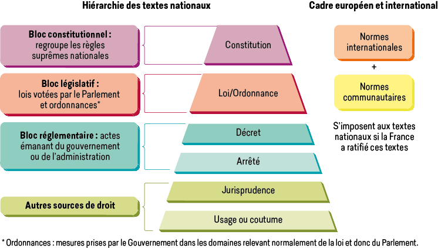
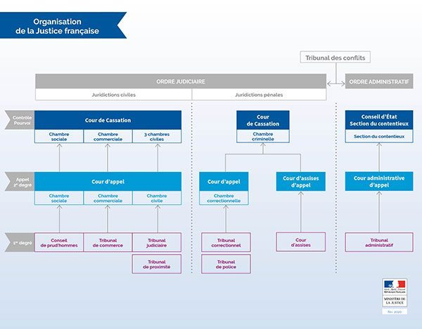

## Introduction

**Droit**: l'expression et la condition de la vie en société: une société ne peut survivre que s'il existe des règles propres pour assurer la coexistence pacifique.
Cet « art de vivre » en société constitue le **droit objectif**.
Sous son égide ,chaque individu jouit de prérogatives juridiques individuelles nommées **droit subjectif**.

## I - L'identification du droit

### A - Droit objectif

**Définition**: Le droit objectif désigne l'ensemble des règles régissant la vie en société. En effet, la règle de droit est:
- **générale et impersonnelle**: elle s'applique à tous les individus de la société
- **permanente**: elle s'applique tant qu'elle n'est pas explicitement abrogée
- **obligatoire**: c'est un commandement, elle impose ou prescrit certain comportements
- **contraignante**: le respect de la règle est assuré par l'autorité publique

**Classification**:
- **Droit publique**: ensemble des règles organisant l'État et régissant les relations en la puissance publique et les particuliers
- **Droit privé**: ensemble des règles régissant les rapports entre les particuliers

- **Droit national** ou interne: ensemble des règles qui s'appliquent dans un État et dont les sanctions sont propres à cet État
- **Droit international**: ensemble des règles régissant les rapports entre les différents États (droit international publique) et applicable aux personnes privées dans leurs relations internationales (droit international privé)

### B - Les droits subjectifs

Les droits subjectifs désignent les prérogatives reconnues à une personne par le droit objectif pour la satisfaction d'un intérêt personnel et qui doivent être exercés en tenant compte des impératifs de la vie sociale.

Il sont regroupés en deux grandes catégories:
- **Droits patrimoniaux**: droit subjectifs qui procurent un avantage évaluable en argent (une valeur pécuniaire). On distingue:
 - Les *droits réels*: titre de foncier, carte grise, ...
 - Les *droits personnels*: diplôme, ...
 - Les *droits intellectuels*: brevet, copyright, ...
 Ils sont cessibles, transmissibles aux héritiers, saisissables.
- **Droits extra-patrimoniaux**: droits rattachés à une personne, incessible, intransmissibles, insaisissables
 Exemple: droit de vote, droit à la vie, droit à l'honneur, ...

## II - Les sources du droit

### A - Les sources nationales

**La constitution**: Loi fondamentale, socle de la république.
- Répartition des pouvoirs:
 - Exécutif: président + gouvernement
 - Législatif: parlement (sénat + assemblée nationale)
 - Judiciaire: l'ensemble des tribunaux
- Organisation et fonctionnement des pouvoirs publiques
- Droits et libertés du citoyen

**La loi**: élaborée par le gouvernement et votée par le Parlement, en accord avec la Constitution

**Les règlement, ordonnances, arrêtés** (pouvoir exécutif):
- **Règlement**: adopté par le gouvernement après avis du conseil d'état. Deux types:
 - *Décrets d'application*: précise les loi
 - *Décrets autonomes*: fixe les règles sur les matière ne relevant pas du domaine de la loi
 - **Ordonnances**: établie par le gouvernement pour mener à bien son programme
 - **Arrêtés**: peut être ministériel, préfectoral, municipal

**Jurisprudence** (pouvoir judiciaire): ensemble des décisions prises par les juges par le passé (définie l'interprétation des lois, l'adapte aux évolutions, combles leurs lacunes)

**Sources issues des milieux sociaux et professionnels**:
- Conventions collectives: contrat entre les syndicats et les employeurs pour déterminer les conditions de travail et les garanties sociales
- Règlement intérieur

**Autre sources**:
- Coutumes et usages: pas écrit mais implicite
- Doctrine: travaux effectués par les juristes et universitaires. Influence + ou - le législateur ou le juge.

### B - Les sources internationales et communautaires

**Les traités internationaux**: Accords entre états qui fixent le cadre de leurs relations ou celles de leurs ressortissants respectifs.

**Le droit communautaire**
- Le *droit originaire*: les traités qui fondent l'union européenne
- Le *droit dérivé*: **règlements** qui s'appliquent à tout les états membre de l'UE et **directives** qui sont des objectifs à atteindre, mais l'état choisi le moyen de le faire

## III - L'organisation juridictionnelle de la France

Il y a deux ordres de juridiction:
- **Ordre judiciaire**: règles les litiges entre les justiciables
- **Justice pénale**: spécialisé dans la répression des infractions
- **Justice civile**: compétence générale
- **Ordre administratif**: règles les litiges entre l'administration et les administrés

## IV - Les droits des contrats

**Contrat**: d'après le Code Civil, c'est une convention par laquelle une ou plusieurs personnes s'engagent, envers une ou plusieurs autres, à donner, à faire ou à ne pas faire quelque chose. Toute personne peut contracter si elle n'est pas déclarée incapable par la loi.

**L'échange de volonté**: Le contrat est un accord de volonté entre deux ou plusieurs personnes, il est destiné à créer, modifier, transmettre ou éteindre des obligations.
Le contrat est formé pas la rencontre d'une offre et d'une acceptation par lesquelles les parties manifestent leur volonté de s'engager
Un contrat est considéré comme conclu dès lors que les parties ont manifesté leur accord. Cet accord peut être écrit ou verbal.
Dans certaines situations, la loi impose l'écrit pour valider l'accord des parties, principalement pour les actes impliquant une protection particulière.

**La liberté contractuelle**: Chacun est libre de contracter ou non, de choisir la ou les personnes avec qui il souhaite établir le contrat, et de déterminer la forme et le contenu du contrat, sous réserve de respecter l'ordre publique et la réglementation.
Certains contrat sont:
- Réglementés: par exemple le salaire présent dans le contrat de travail à une limite minimale
- Interdits: vente de drogue par exemple
- Obligatoires: on est obligé d'avoir une assurance pour son logement + sa voiture
- Illicites: lorsqu'il conditionnent l'achat d'un produit à l'achat d'une prestation de servie non souhaitée par l'acheteur.

**La validité d'un contrat**:
- Les parties doivent consentir, et il ne doit pas y avoir de vices comme:
 - L'*erreur*: la méprise sur la chose ou la personne
 - La *violence*: contrainte physique ou morale
 - Le *dol*: tromperie volontaire
- Toute les personnes concernées doivent être capable de contracter
- L'objet du contrat doit être licite (légal) et certain (tous les partis savent bien de quoi on parle)

**La classification des contrats**:
- Contrat *synallagmatique*: les deux parties ont des engagements envers l'autre
- Contrat *unilatéral*: une seule partie à des obligations envers l'autre. Différent de l'acte *juridique* unilatéral dans lequel une seule personne engage sa propre volonté

- Contrat à exécution *instantanée*: s'exécute en une seule fois
- Contrat à exécution *successive*: s’échelonne dans le temps

- Contrat de *gré à gré*: les modalités sont librement négociés par les deux parties
- Contrat d'*adhésion*: une des parties impose à l'autre les clauses du contrat. La liberté accordé à l'autre partie est d'accepter ou de refuser le contrat.

- Contrat *individuel*: ne produits des effets que pour ceux qui se sont engagés
- Contrat *collectif*: s'applique aussi aux gens qui ne sont pas engagés (genre les convention collectives)
